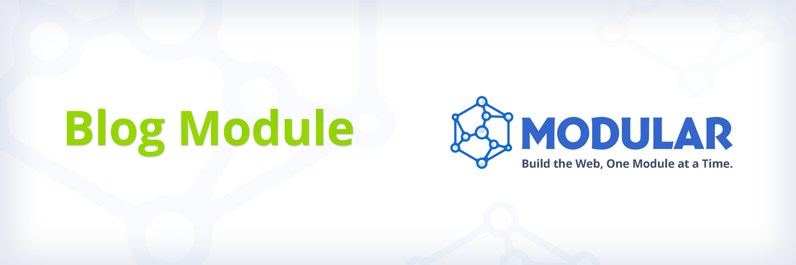
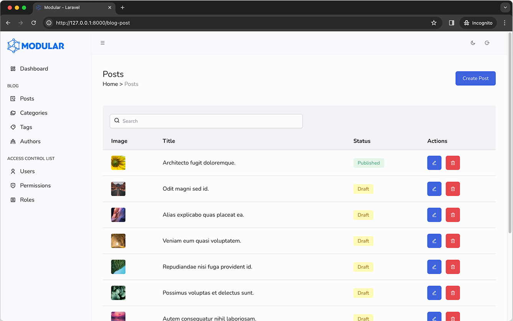
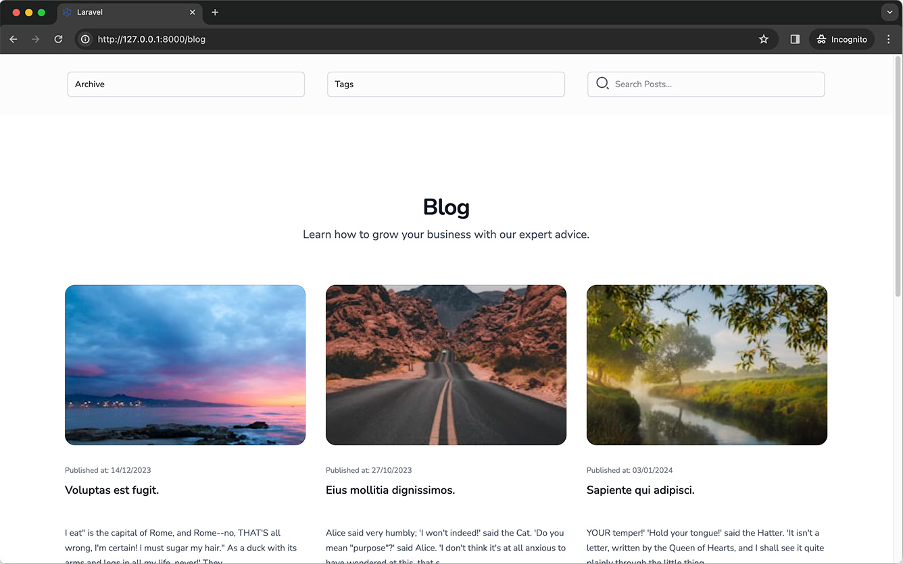

<p align="center" style="margin: 24px;">
    <a href="https://docs.ismodular.com" target="_blank">
    </a>
</p>

<center>

[](https://vuejs.org/)
[](https://inertiajs.com/)
[](https://laravel.com)
[](https://tailwindcss.com/)
[](https://github.com/daniel-cintra/modular-blog/actions)

</center>

## Modular's Blog Module

The Modular Blog Module is a comprehensive solution for adding a blog to applications built with the [Modular Project](https://docs.ismodular.com).

The **Blog Module's CMS** (Content Management System) side, has the following features:

-   Posts Management
-   Categories Management
-   Tags Management
-   Authors Management



You can easily create posts using a Fully Featured WYSIWYG Editor, and manage them using a simple and intuitive interface to create, edit, and delete posts, categories, tags, and authors, also allowing you to manage the posts' status and visibility through publication dates.

The **Blog Module Public Views** offers the following features:

- **Archive Selector:** Automatically groups posts by month and year, allowing users to filter posts by specific periods.
- **Tag Selector:** Enables filtering of posts by specific tags. By default, only tags with associated posts are displayed.
- **Search Posts:** Incorporates a simple search feature within the module.



Designed as a lightweight yet robust foundation, the Modular Blog Module provides **flexibility for customization and feature expansion** (such as post comments and ratings). This makes it a versatile tool for developers aiming to integrate comprehensive blog functionalities into their applications, catering to a wide array of requirements.

## Preparing to install the Modular Blog Module

Before installing the Modular Blog Module, please ensure the following steps are completed:

1. **Modular Project Installation**: Confirm that the Modular Project is installed and configured in your Laravel application. If this step is incomplete, please consult the [Modular Project's Installation Guide](https://docs.ismodular.com/getting-started.html) for assistance.

2. **Site Files Publication**: With the Modular Project set up, proceed to [Publish Site Files](https://docs.ismodular.com/essentials/site-setup.html) as outlined in the documentation. This step is crucial for successfully integrating the Modular Blog Module.

Now that you have all set, proceed to install the Modular Blog Module.

## Installation

To install the Modular Blog Module, you need to require it using Composer:

```bash
composer require daniel-cintra/modular-blog
```

Then, initiate the module installation:

```bash
php artisan modular:blog-install
```

This action publishes essential files and runs migrations, with an option to seed the database with default data.

### Check npm dependencies

The Blog Module has a dependency on the [Pinia Store](https://pinia.vuejs.org/) npm package. If you don't have it installed in your project, follow these steps:

1 - On your project root run:

```bash
npm install -D pinia
```

2 - Open the file `resources/js/app.js` and add the Pinia `import { createPinia } from 'pinia'` and the `.use(createPinia())` blocks.

```js
...
import { createPinia } from 'pinia'

createInertiaApp({
    ...
    setup({ el, App, props, plugin }) {
        return createApp({ render: () => h(App, props) })
            .use(createPinia())
            .use(plugin)
            ...
    }
})
```

## Final Configuration Steps

### 1 - BlogServiceProvider

Add the BlogServiceProvider to `/config/app.php`

```php
    'providers' => ServiceProvider::defaultProviders()->merge([
        ...
        Modules\Blog\BlogServiceProvider::class,

    ])->toArray(),
```

### 2 - Backend Menu Items

Add the menu items to the `resources/js/Configs/menu.js` items array:

```js

export default {
    // Main Navigation - Side Menu
    items: [
        ...
        {
            label: 'Blog',
            permission: 'Blog',
            children: [
                {
                    label: 'Posts',
                    permission: 'Blog: Post - List',
                    icon: 'ri-draft-line',
                    link: route('blogPost.index')
                },
                {
                    label: 'Categories',
                    permission: 'Blog: Category - List',
                    icon: 'ri-folders-line',
                    link: route('blogCategory.index')
                },
                {
                    label: 'Tags',
                    permission: 'Blog: Tag - List',
                    icon: 'ri-price-tag-3-line',
                    link: route('blogTag.index')
                },
                {
                    label: 'Authors',
                    permission: 'Blog: Author - List',
                    icon: 'ri-team-line',
                    link: route('blogAuthor.index')
                }
            ]
        },
        ...
    ]
}
```

### 3 - Frontend

In `vite.config.js` manually add the `resources-site/js/blog-app.js` entry to the laravel plugin `input` array:

```js
plugins: [
    laravel({
        input: [
            ...
            'resources-site/js/blog-app.js'
        ],
        refresh: [
        ]
    }),
    ...
],
```

With the installation steps completed as outlined, the Blog Module should now be fully operational within your application. This marks the completion of the setup process, enabling you to start using the module's features for managing and publishing blog content.

### Compiling the assets

To view the changes on your project run:

```bash
npm run dev
```

#### Blog CMS

To access the Blog Module's CMS (Content Management System), login in to the Modular CMS using the configured path in your `config/modular.php` file in the `login-url` key (for example `/admin`). The Blog Management links will be listed in the sidebar menu.

#### Blog Site View 

By default, you can access the blog posts controller in the `/blog` route registered by the module.

### Blog Seeders (Optional Step)

The Blog Module includes two built-in seeders:

1. **BlogSeeder**: This seeder populates your database with `posts`, `authors`, `categories`, and `tags`. It also fetches images online to enrich `posts`, `authors`, and `categories`. Since it retrieves images from the internet, the seeding process may take a few seconds. A progress bar indicator is included within the Seeder, allowing you to monitor the progress of the operation.

2. **BlogAclSeeder**: This seeder creates the Access Control List (ACL) Permissions related to the Blog Module. These permissions can then be associated with the desired `ACL Role` through the application's interface, facilitating the management of user permissions within the blog module.

You have the option to manually run the seeders or include them in the `database/seeders/DatabaseSeeder.php` file for automatic execution. This flexibility allows you to tailor the seeding process to your application's needs, ensuring that the Blog Module is populated with initial data or configured with the necessary ACL permissions as part of your project's overall database seeding strategy.

#### Adding the Seeders to the DatabaseSeeder File

To integrate the seeders with your application's seeding process, add them to the `DatabaseSeeder.php` file located in `database/seeders`. Here's how to do it:

1. Import the `BlogSeeder` and `BlogAclSeeder` at the top of your `DatabaseSeeder.php` file.
2. Inside the `run` method of your `DatabaseSeeder`, invoke the seeders by calling their respective `run` methods.

This setup ensures that when you run the database seeding command, both the BlogSeeder and BlogAclSeeder are executed, populating your database with initial blog data and setting up ACL permissions accordingly.

```php
<?php

namespace Database\Seeders;

use Illuminate\Database\Seeder;
use Modules\Blog\Database\Seeders\BlogAclSeeder;
use Modules\Blog\Database\Seeders\BlogSeeder;

public function run(): void
{
    $this->call(BlogAclSeeder::class);
    $this->call(BlogSeeder::class);
}
```

#### Manually executing the Seeders

To manually run the seeders, execute the following commands in your terminal:

For the `BlogSeeder`:

```bash
php artisan db:seed --class="Modules\\Blog\\Database\\Seeders\\BlogSeeder"
```

And for the `BlogAclSeeder`:

```bash
php artisan db:seed --class="Modules\\Blog\\Database\\Seeders\\BlogAclSeeder"   
```
These commands allow you to selectively seed your database with the blog module's content and ACL permissions, offering a more controlled setup process.

## License

The Modular Project is open-source software licensed under the [MIT license](LICENSE.md).
